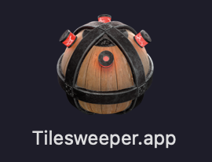

# Steam App Icon Matcher for Mac

before


after



## Usage

requires
- yarn
- ts-node

1. make folder for your steam app
2. copy all steam apps you want to resolve icon to folder
3. open terminal and run
```zsh
yarn
yarn start
```
4. move apps back
